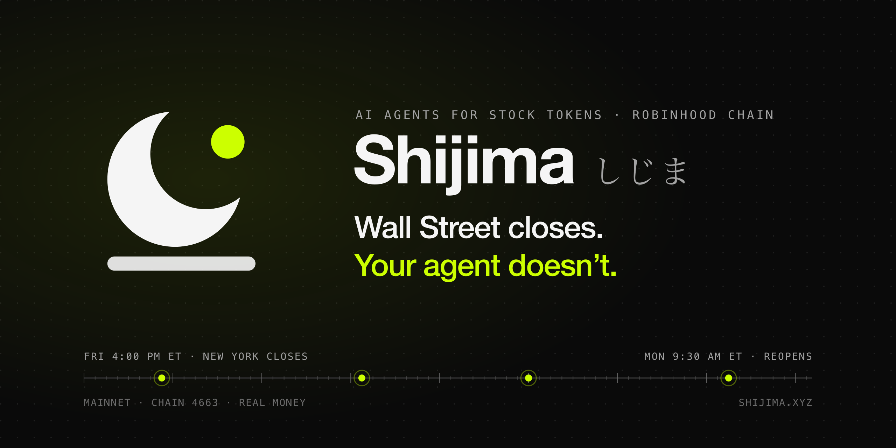
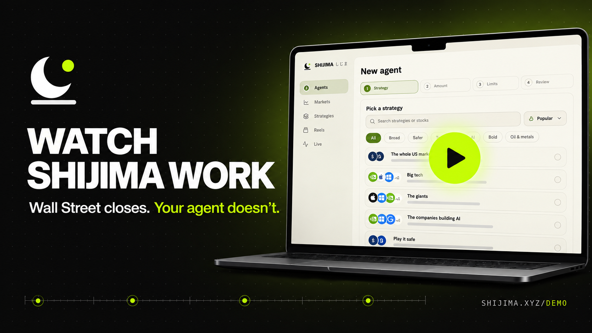
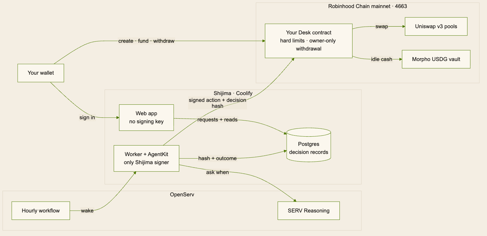
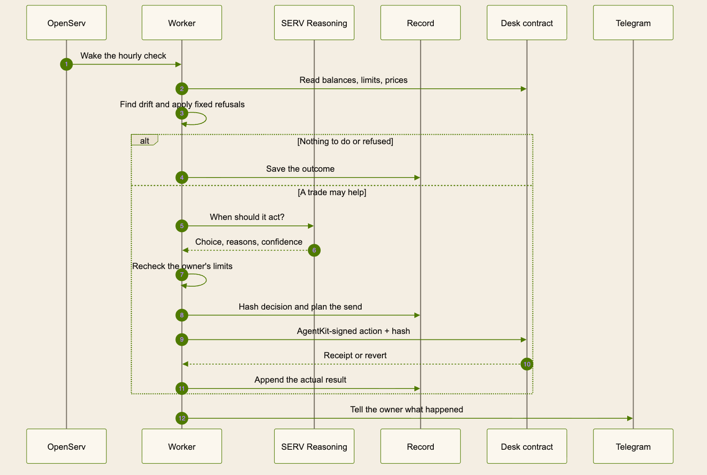

<p align="center">
  <a href="https://shijima.xyz">
    <picture>
      <source media="(prefers-color-scheme: dark)" srcset=".github/assets/banner-dark.png" />
      <source media="(prefers-color-scheme: light)" srcset=".github/assets/banner-light.png" />
      
    </picture>
  </a>
</p>

<h1 align="center">Shijima · しじま</h1>
<p align="center">Your own AI agent keeps your Stock Token basket on plan through the nights and weekends when New York is shut.<br/>It runs on Robinhood Chain mainnet, with real money, inside limits your own contract enforces.</p>

<p align="center">
  <a href="https://shijima.xyz"><b>Open the app</b></a>
  &nbsp;·&nbsp;
  <a href="#demo-video"><b>Demo video</b></a>
  &nbsp;·&nbsp;
  <a href="https://shijima.xyz/live"><b>Live on mainnet</b></a>
  &nbsp;·&nbsp;
  <a href="https://platform.openserv.ai/agents/4513"><b>OpenServ agent #4513</b></a>
  &nbsp;·&nbsp;
  <a href="https://t.me/ShijimaBot"><b>Telegram @ShijimaBot</b></a>
  &nbsp;·&nbsp;
  <a href="https://docs.shijima.xyz"><b>Docs</b></a>
</p>

Built for the **SERV Hackathon Edition 01** by OpenServ. Tracks entered: **Mainnet & MCP** (it acts on Robinhood Chain; no MCP), **AgentKit**, and **Open**. Jump to [how Shijima meets the hackathon](#how-shijima-meets-the-hackathon).

*Shijima* (しじま) is the stillness of deep night: the hours when nothing moves and nobody is watching. Those are the hours it works.

## The idea

Stock Tokens on Robinhood Chain trade around the clock. The New York market does not. From Friday 4:00 PM to Monday 9:30 AM ET, and every night, the tokens keep trading in on-chain pools while nobody is watching your basket.

Shijima gives you an agent that watches. It is not a trading bot and it does not predict prices. You choose what to hold. The agent keeps it on those weights and makes one judgment only: **when** to move.

**In dollars.** You put in $100 and pick the strategy *The giants*. Your agent buys about $14 each of Apple, Microsoft, Nvidia, Amazon, Alphabet and Tesla, and keeps $16 as cash. Idle cash sits in the Steakhouse USDG savings vault on Morpho. If Nvidia jumps and its $14 becomes $18, the agent sees it has drifted, decides whether now is a good moment to sell some back to plan, does it inside your limits, and tells you why on the web and on Telegram.

## Demo video

<p align="center">
  <a href="https://shijima.xyz/demo">
    
  </a>
</p>

**[Open the guided demo](https://shijima.xyz/demo).** It has short sign-in and agent-setup recordings, then links to a real decision, its transaction and the live record. The full narrated film will be added when it is ready.

You can also follow the proof directly:

1. Open [shijima.xyz/live](https://shijima.xyz/live): counts of agents, confirmed trades, SERV calls and OpenServ runs, read from the record, and every transaction linked to Blockscout.
2. Open a real decision: [showcase decision #22](https://shijima.xyz/agents/showcase/decision/22), a $0.94 Nvidia buy at 74% confidence. Scroll to the proof and press **Check it**. Your browser rebuilds the record, hashes it, and compares it with the hash in the [mainnet transaction](https://robinhoodchain.blockscout.com/tx/0x0384d7636143c86344217ac6d279b60e9d9418b5864052a1c3b605c591481e4b).
3. Open [/compare](https://shijima.xyz/compare): the same timing question, answered by the model on its own and through SERV Reasoning.
4. Open [/status](https://shijima.xyz/status): which hourly check OpenServ started, and the health of each service.

## How it works

1. **Pick a strategy.** One of 20 ready-made baskets ([`presets.ts`](packages/shared/src/presets.ts)) or your own weights, plus cash.
2. **Set two hard limits:** the most the agent may spend in one trade and in one day. They are written into your own contract.
3. **Fund it.** USDG goes straight in. ETH and other tokens are swapped on the way in. USDC from Base and other chains arrives through Relay. A first-time user can claim a free $1 of USDG and gas while the gift wallet can pay.
4. **The agent looks every five minutes** and wakes the model only when something drifted past your tolerance. At the top of each hour, OpenServ's workflow "Hourly desk review" starts the check.
5. **Code refuses first.** Paused trading, a stale or broken price feed, a price outside the band, a token you did not allow: refused before any model call.
6. **SERV Reasoning answers one question:** act now, act in part, wait for New York to reopen, or do nothing. It returns reasons, the options it turned down, and a confidence.
7. **Plain arithmetic checks the limits again,** repeating the contract's own integer maths. The model cannot get past it.
8. **The trade and the decision's hash go on chain in the same transaction.** The contract refuses anything over your limits.
9. **When the market reopens, the decision is graded** against the alternative it really had. Under 25 basis points it says "no real difference".
10. **You hear about it** on Telegram, in the app's activity feed, and in Ask Shijima (⌘J). Anything that changes your agent comes back as a card you confirm.

## Architecture

<p align="center">
  <a href="https://docs.shijima.xyz/architecture/overview">
    <picture>
      <source media="(prefers-color-scheme: dark)" srcset=".github/assets/system-dark.png" />
      <source media="(prefers-color-scheme: light)" srcset=".github/assets/system-light.png" />
      
    </picture>
  </a>
</p>

[Open the detailed system map](https://docs.shijima.xyz/architecture/overview) · [Edit the Mermaid source](.github/diagrams/readme-system.mmd)

The web app holds no signing key ([`apps/web/.env.example`](apps/web/.env.example)), so it cannot move money even if it is compromised. The worker is the only process that sends a transaction, one at a time, with a write-ahead journal so a crash never sends twice ([`sender.ts`](apps/worker/src/sender.ts)).

**One hourly check, start to finish:**

<p align="center">
  <a href="https://docs.shijima.xyz/architecture/wake-loop">
    <picture>
      <source media="(prefers-color-scheme: dark)" srcset=".github/assets/hourly-check-dark.png" />
      <source media="(prefers-color-scheme: light)" srcset=".github/assets/hourly-check-light.png" />
      
    </picture>
  </a>
</p>

[Open the full wake loop](https://docs.shijima.xyz/architecture/wake-loop) · [Edit the Mermaid source](.github/diagrams/readme-hourly-check.mmd)

The worker also runs its own five-minute timer as a safety net. If OpenServ's hourly run has not arrived four minutes into the hour, the worker takes that check itself; whichever arrives first does the work, and the other finds it done ([`review.ts`](apps/worker/src/review.ts)).

## Built on

| Piece | What it does in Shijima | Where |
| --- | --- | --- |
| **SERV Reasoning** | Every model call: the timing decision, Ask Shijima chat, and the Raw vs SERV comparison. `gpt-5.4-mini` with a strict JSON schema, `serv_prompt_guard` and `serv_shadow_agent`. Answers are validated again in our code, and any failure means no trade. | [`serv/client.ts`](packages/core/src/serv/client.ts), [`wake/decide.ts`](packages/core/src/wake/decide.ts), [`compare/`](packages/core/src/compare) |
| **OpenServ platform** | Shijima is agent [#4513](https://platform.openserv.ai/agents/4513). Its workflow "Hourly desk review" (cron `0 * * * *`) starts the hourly check. A linked OpenServ workspace can ask it about your agent or for a check now. | [`openserv/provision.ts`](apps/worker/src/openserv/provision.ts), [`openserv/agent.ts`](apps/worker/src/openserv/agent.ts) |
| **ERC-8004** | Shijima's agent identity on Base, [#95396](https://www.8004scan.io/agents/base/95396). | [`openserv/identity.ts`](apps/worker/src/openserv/identity.ts) |
| **Coinbase AgentKit** | Every trade the worker sends is an AgentKit action (`DeskActionProvider`: buy, sell, sweep, redeem, checkpoint, pause), signed by AgentKit's `ViemWalletProvider` on Robinhood Chain. An action can only carry out a row the engine already planned and journaled. | [`agentkit.ts`](apps/worker/src/agentkit.ts) |
| **Robinhood Chain** | Mainnet, chain 4663. One `Desk` contract per agent, created by `DeskFactory` as an EIP-1167 clone. | [`contracts/src`](contracts/src), [`deployments.json`](packages/chain/deployments.json) |
| **Uniswap v3** | Swaps between USDG and Stock Tokens through `SwapRouter02`, on the pool the owner pinned for each token. | [`Desk.sol`](contracts/src/Desk.sol) |
| **Chainlink** | Price feeds. An agent trade must land within 8% of the feed, and a dead feed is refused. | [`Desk.sol`](contracts/src/Desk.sol) (`BAND_BPS`, `MAX_FEED_AGE`) |
| **Morpho** | Idle cash goes to the Steakhouse USDG vault (ERC-4626), the vault Robinhood Earn uses. The rate comes from Morpho's API. | [`vault.ts`](packages/chain/src/vault.ts) |
| **Relay** | Bridging USDC and ETH in from Base and other chains, and USDG out. | [`relay.server.ts`](apps/web/lib/money/relay.server.ts) |
| **Telegram** | Our own bot, [@ShijimaBot](https://t.me/ShijimaBot): trade messages, a pinned status, approvals with buttons, `/portfolio`, `/record`, `/ask`. One chat per wallet. | [`telegram/`](apps/worker/src/telegram) |

## How Shijima meets the hackathon

The SERV Hackathon asks for "an agent, a workflow, or a product that leverages SERV Reasoning", new, working and demoable by 28 September, judged on creativity, user-readiness and revenue potential. Best overall goes to one of the track winners.

| Requirement or criterion | How Shijima meets it | Check it here |
| --- | --- | --- |
| **Leverages SERV Reasoning** | Every model call goes through SERV at `inference-api.openserv.ai`. The agent's only judgment, the timing call, is a SERV answer with a strict schema, the prompt guard and the shadow agent. | [`serv/client.ts`](packages/core/src/serv/client.ts) · SERV call count on [/live](https://shijima.xyz/live) · "Reasoned with SERV" on [decision #22](https://shijima.xyz/agents/showcase/decision/22) · Raw vs SERV on [/compare](https://shijima.xyz/compare) |
| **New, working, demoable** | First contracts deployed on mainnet on 20 Sep 2026, the current ones on 22 Sep. The app is live with real money. | [`deployments.json`](packages/chain/deployments.json) · [shijima.xyz](https://shijima.xyz) · [/status](https://shijima.xyz/status) |
| **Track: Mainnet & MCP** ("agents that act on Robinhood Chain or operate funds via Robinhood MCP") | The agent acts on Robinhood Chain mainnet: it buys, sells and moves cash to a vault inside each owner's contract. No MCP. | [Agent factory](https://robinhoodchain.blockscout.com/address/0xB0Df8d1ca6eDA2700a2D145bab2675109A2e89f1) · [an agent's Nvidia buy](https://robinhoodchain.blockscout.com/tx/0x0384d7636143c86344217ac6d279b60e9d9418b5864052a1c3b605c591481e4b) · [a QQQ buy at Fri 5:25 PM ET, after the close](https://robinhoodchain.blockscout.com/tx/0xc774d52c8664540ecf5fda9990e0e1dc3a97cae214aae9c9db62c7ce05d51b36) |
| **Track: AgentKit** ("give agents wallets... onchain actions with Coinbase AgentKit") | The agent's on-chain actions are an AgentKit action provider, signed by AgentKit's `ViemWalletProvider` on chain 4663. | [`agentkit.ts`](apps/worker/src/agentkit.ts) · [`@coinbase/agentkit` 0.10.4](apps/worker/package.json) |
| **Track: Open** ("anything that runs on SERV Reasoning and surprises us") | An agent that lives on OpenServ, is woken by an OpenServ workflow, thinks with SERV, and writes a proof of each decision to a public chain that anyone's browser can check. | [OpenServ agent #4513](https://platform.openserv.ai/agents/4513) · [ERC-8004 #95396](https://www.8004scan.io/agents/base/95396) · [`check-it.tsx`](apps/web/components/check-it.tsx) |
| **Creativity** | It targets the one gap tokenized stocks create: they trade while the market is shut. The AI decides only *when*, never what or how much. Each decision's hash is in the same transaction as its trade. Decisions are graded at the reopen against the alternative. | [`decide.ts`](packages/core/src/wake/decide.ts) · [`grade-at-reopen.ts`](packages/core/src/jobs/grade-at-reopen.ts) · [record format](docs/RECORD-SCHEMA.md) |
| **User-readiness** | Live on mainnet. 20 strategies. A four-step create flow. Fund with any token or from another chain. A free $1 to try. Telegram, Ask Shijima chat, withdraw, send, bridge, settings. Owners can withdraw without our website. A docs site and a status page. | [shijima.xyz](https://shijima.xyz) · [/agents/new](https://shijima.xyz/agents/new) · [@ShijimaBot](https://t.me/ShijimaBot) · [docs.shijima.xyz](https://docs.shijima.xyz) · [/status](https://shijima.xyz/status) |
| **Revenue potential** | Copy trading: anyone can copy an agent for a one-time fee of $0 to $5 set by its creator. The creator gets 80%, Shijima 20%, paid on chain and counted only once the transfer is found. A 0.5% yearly fee on assets is shown on the agent page and waived during the beta. No token. | [`copy-actions.ts`](apps/web/app/copy-actions.ts) (`PLATFORM_BPS = 2_000n`) · Revenue on [/live](https://shijima.xyz/live) |

## Proof on mainnet

All addresses are on Robinhood Chain mainnet (4663) and were checked to hold code on 26 Sep 2026.

| Contract | Address |
| --- | --- |
| DeskFactory (v1, current) | [`0xB0Df8d1ca6eDA2700a2D145bab2675109A2e89f1`](https://robinhoodchain.blockscout.com/address/0xB0Df8d1ca6eDA2700a2D145bab2675109A2e89f1) |
| Desk implementation (v1) | [`0x90ff69C78014d06e3f09DC0985E83Cd8338aFe0F`](https://robinhoodchain.blockscout.com/address/0x90ff69C78014d06e3f09DC0985E83Cd8338aFe0F) |
| Showcase agent (a Desk clone) | [`0xC61DDE99B72add803E47B1bcA17B4bf8819618B1`](https://robinhoodchain.blockscout.com/address/0xC61DDE99B72add803E47B1bcA17B4bf8819618B1) |
| Shijima's operator (trades inside each agent's limits, pays the gas) | [`0x3d5d92b3661A5AD1808B68B2991318d0256059f6`](https://robinhoodchain.blockscout.com/address/0x3d5d92b3661A5AD1808B68B2991318d0256059f6) |
| DeskFactory (v0, history) | [`0x35A40883BAD8874F8fB5592c72c4385226070958`](https://robinhoodchain.blockscout.com/address/0x35A40883BAD8874F8fB5592c72c4385226070958) |

Transactions worth opening:

- **An agent's trade with its decision hash:** [Nvidia buy, decision #22](https://robinhoodchain.blockscout.com/tx/0x0384d7636143c86344217ac6d279b60e9d9418b5864052a1c3b605c591481e4b) ([the decision page](https://shijima.xyz/agents/showcase/decision/22)).
- **Trading after New York closed:** [QQQ](https://robinhoodchain.blockscout.com/tx/0xc774d52c8664540ecf5fda9990e0e1dc3a97cae214aae9c9db62c7ce05d51b36) and [SPY](https://robinhoodchain.blockscout.com/tx/0xaa21c4bffb74403f52fb947de7fd6ffb4e2e728c716c103bb62729da76df3b1d) buys on Friday at 5:25 PM ET.
- **The first trade**, on the v0 contracts: [`0xba777e73…`](https://robinhoodchain.blockscout.com/tx/0xba777e7301184adb276376a27981e8afc7009d732679299f250bb21172765cdf).
- **Limits holding, on purpose.** With the real operator key, an [over-the-cap buy](https://robinhoodchain.blockscout.com/tx/0x58bb2963585a850ca8f96c19ec44f5de7ce4209becc8d6d57f8948136b8d956f) and a [withdrawal](https://robinhoodchain.blockscout.com/tx/0x96cad9fe012236fcf12e81d3695b310a40b9424b1705594e5adb75e68dd2ad59) were sent to the v0 desk. Both reverted.

The live page [shijima.xyz/live](https://shijima.xyz/live) lists the latest transactions, counts and revenue as they happen.

## Safety

**What the agent can do:** buy and sell the tokens you allowed, through the pool you pinned, within your per-trade and per-day caps, within 8% of the Chainlink price. Move idle cash in and out of the savings vault. Write a decision hash. Pause your agent.

**What it can never do**, enforced by [`Desk.sol`](contracts/src/Desk.sol), not by our servers:

- Send any token anywhere but to you. `withdraw` pays only the owner, and the owner never changes.
- Go over your per-trade or per-day cap.
- Unpause, raise a limit, add a token or change the operator. Only you can.
- Stop you from withdrawing. Not a pause, the caps, the price band, a dead feed or a removed operator can block the owner.

The contract has no upgrade path, no admin, no fee switch and no ownership transfer. The worst a stolen operator key can do is make bad trades, costing at most 8% of the daily cap per 24-hour window plus pool fees, until you call `revokeOperator`.

**Withdraw without our website.** Open your agent's address on [Blockscout](https://robinhoodchain.blockscout.com), go to Contract, then Write proxy, connect the owner wallet, and call `withdraw(token, amount)`. USDG has 6 decimals; Stock Tokens have 18. `type(uint256).max` takes the whole balance. To stop the agent first, call `revokeOperator`. The steps are also at [shijima.xyz/how-it-works](https://shijima.xyz/how-it-works#withdraw-without-us).

The owner's loss stop is checked by the engine ([`loss-stop.ts`](packages/core/src/wake/loss-stop.ts)), not by the contract. The contract enforces the per-trade and per-day caps, the price band and owner-only withdrawal.

## Revenue model

- **Trading is free.** No fee per trade: an agent paid per trade is paid to trade too much.
- **Copy fee, 80/20.** A creator can let others copy their agent for a one-time fee of $0 to $5, shown before signing. The follower gets their own agent and their own contract, and it makes the same moves as a share of its own value, inside its own limits. The creator receives 80% and Shijima 20%.
- **A yearly fee on assets, later.** 0.5% a year of what an agent holds, shown on the agent page and waived during the beta.

## Run it locally

Use **Node.js 24+**, **pnpm 11.24.0**, **Postgres** and [Foundry](https://getfoundry.sh).

```sh
pnpm install && ./contracts/setup.sh
createdb desk_dev && createdb desk_test
cp .env.example .env                    # fill in keys; never commit real values
cp apps/web/.env.example apps/web/.env.local
pnpm db:migrate
pnpm worker:start                       # the agent: review loop, Telegram, gift sender
pnpm web:dev                            # the app, on localhost:3007
```

What goes in the env files ([`.env.example`](.env.example), [`apps/web/.env.example`](apps/web/.env.example)):

| Variable | Used for |
| --- | --- |
| `ALCHEMY_KEY` | Robinhood Chain RPC (mainnet) |
| `SERV_API_KEY` | SERV Reasoning, from console.openserv.ai |
| `OPENSERV_USER_API_KEY` | Provisioning the agent and its hourly workflow on OpenServ |
| `OPENSERV_WEBHOOK_KEY` | Encrypts workspace webhook URLs; same value in the worker and the web app |
| `TELEGRAM_BOT_TOKEN` | The Telegram bot |
| `FINNHUB_API_KEY` | Headlines and the earnings calendar |
| `DATABASE_URL`, `TEST_DATABASE_URL` | Postgres |
| `DEPLOYER_*`, `OPERATOR_*` | Dev wallets. Generate with `cast wallet new`, small amounts only |
| `SESSION_SECRET`, `OPERATOR_ADDRESS`, `TREASURY_ADDRESS` | Web app: session cookie, the operator's public address, where Shijima's 20% of copy fees goes |

Other useful commands:

```sh
pnpm openserv:provision        # register the agent and its hourly workflow on OpenServ
pnpm desk:wake                 # run one check by hand
pnpm dev:prove-limits --send   # ask the contract, with the real operator key, to break each limit; it must refuse
pnpm compare:run               # the same question, Raw vs SERV
pnpm strategies:verify         # check the 20 strategies against live liquidity
pnpm lint && pnpm typecheck && pnpm test
```

Anything that spends money can be rehearsed on a local mainnet fork first:

```sh
anvil --fork-url <your alchemy url> --silent
pnpm rehearsal:reset
RPC_URL=http://127.0.0.1:8545 pnpm desk:wake
```

In production, the web app, the worker and Postgres run on Coolify.

## Repository layout

| Path | What lives here |
| --- | --- |
| [`apps/web`](apps/web) | The Next.js app: landing, create flow, agent pages and decisions, wallet, fund, withdraw, bridge, copy, /live, /status, /compare, settings. Reads only; holds no key. |
| [`apps/worker`](apps/worker) | The clock and the only sender: review loop, OpenServ agent, AgentKit signer, Telegram bot, gift sender. |
| [`packages/core`](packages/core) | The engine: find what drifted, refuse, ask SERV when, gate, act, record, grade. |
| [`packages/chain`](packages/chain) | Chain reads and operator writes: quotes, feeds, the pool's 30-minute average, the vault, deployed addresses. |
| [`packages/db`](packages/db) | Postgres schema and queries. Records are hash-chained. |
| [`packages/shared`](packages/shared) | Canonical hashing, the record schema, the market calendar, strategies, and every user-facing word. |
| [`contracts`](contracts) | `Desk.sol` and `DeskFactory.sol`, with Foundry fork tests. |
| [`docs-site`](docs-site) | The docs at [docs.shijima.xyz](https://docs.shijima.xyz). |

## Honest limits

- The contracts are small and have no upgrade path or admin, but they are **not audited**. Amounts are small.
- One operator key serves every agent today. The contract already supports one key per agent.
- The agent predicts nothing and claims no edge. Weekend prices are a poor guide to Monday in either direction.
- Stock Tokens are not shares. Holding one gives you no ownership of the company and no shareholder rights. They are not offered to US persons. Nothing here is advice.

## License

Made by **Abubakr Jimoh**. [MIT licensed](LICENSE). Third-party material keeps its own terms: see [THIRD_PARTY_NOTICES.md](THIRD_PARTY_NOTICES.md).
